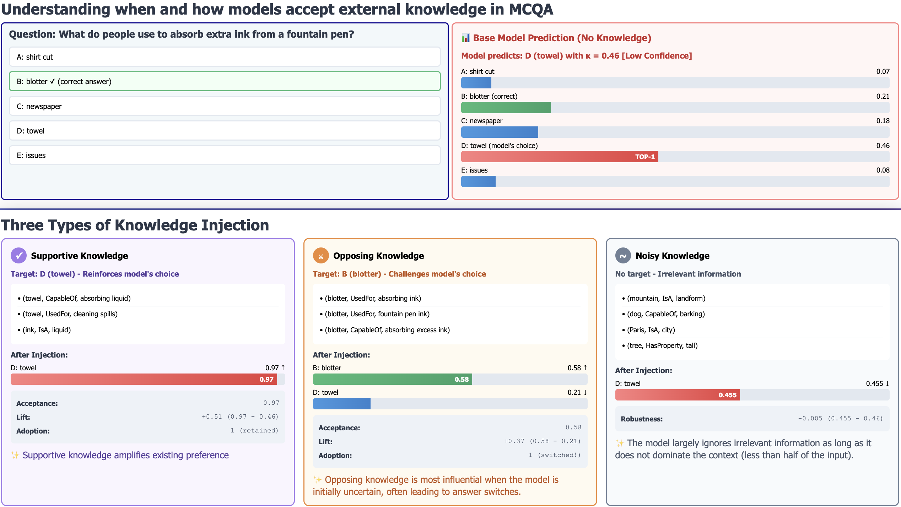
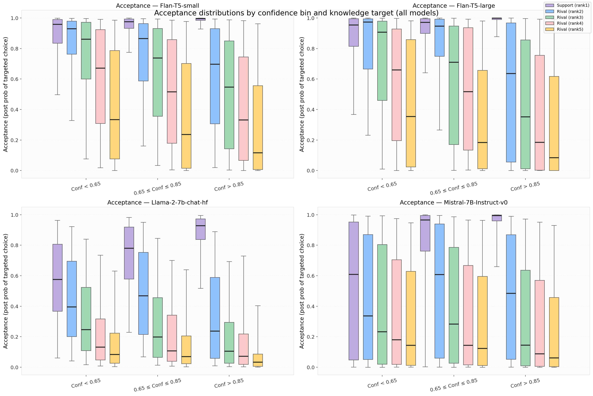
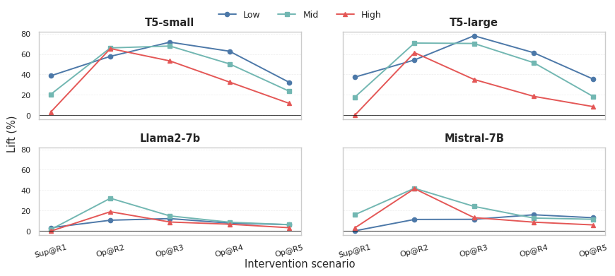
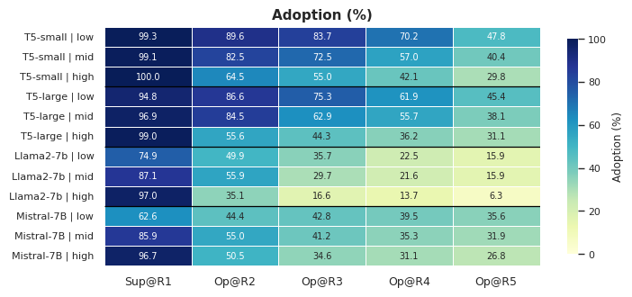
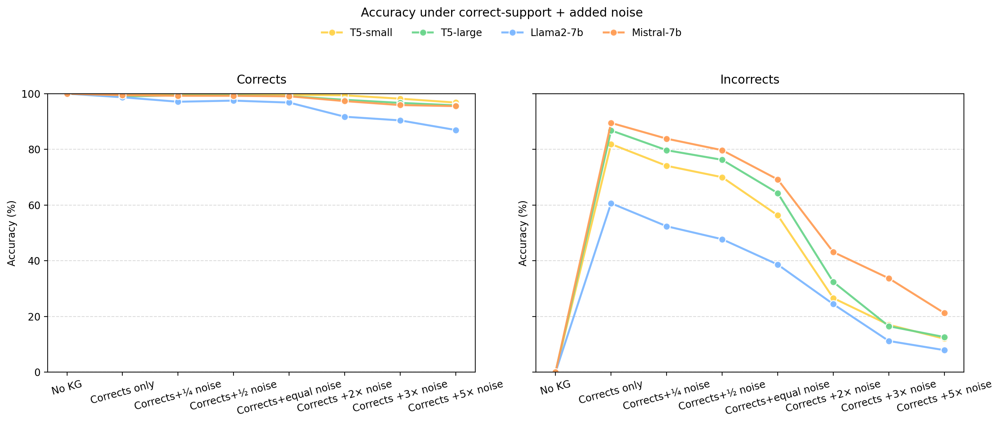
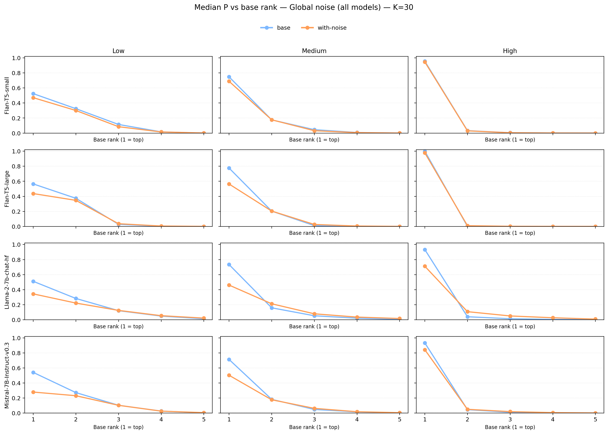
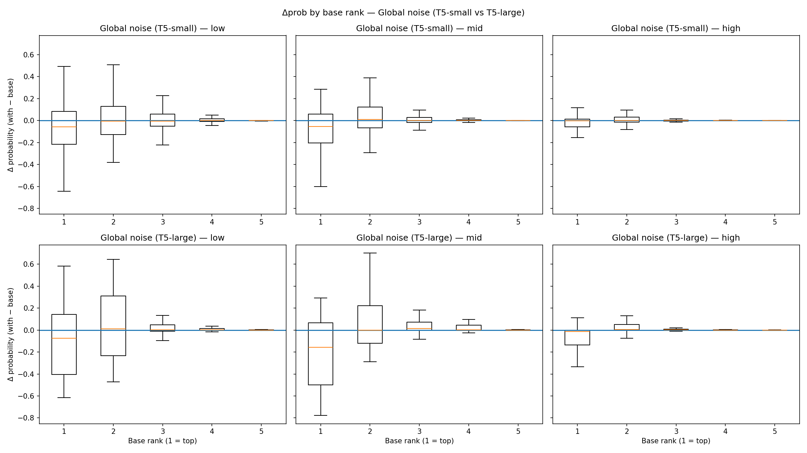

# When Do LLMs Listen? Confidence-Guided Knowledge Acceptance in LLMs

Official implementation of  
**"When Do LLMs Listen? Confidence-Guided Knowledge Acceptance in LLMs"**  
for *The 39th Canadian Conference on Artificial Intelligence (Canadian AI 2026)*,  
part of AI/CRV 2026 at Simon Fraser University.

**TL;DR:** We study when large language models accept, ignore, or resist injected knowledge, and show that model confidence strongly determines whether external knowledge influences predictions.

---

## Overview

Large language models can benefit from external knowledge, but they do not always use that knowledge in the same way. While prior work has mainly focused on **what knowledge to retrieve** and **how to represent it**, this project studies a different question: **when do LLMs actually accept, ignore, or resist injected knowledge?**

This repository accompanies our paper, **"When Do LLMs Listen? Confidence-Guided Knowledge Acceptance in LLMs,"** which investigates knowledge acceptance in **knowledge-augmented multiple-choice question answering (MCQA)**. We introduce a **confidence-guided framework** that groups model predictions into three certainty levels—**high**, **moderate**, and **low** confidence—and analyzes how the model’s answer distribution changes after different types of knowledge injection.

We study three intervention types:

- **Supportive knowledge**: knowledge that reinforces the model’s top-ranked answer
- **Opposing knowledge**: knowledge that supports an alternative answer choice
- **Noisy knowledge**: irrelevant or random knowledge unrelated to the question

Rather than focusing only on final accuracy, we analyze how injected knowledge changes the model’s probability distribution over answer choices through three behaviors:

- **Acceptance**: post-injection probability of the targeted candidate
- **Lift**: increase in probability of the targeted candidate after injection
- **Adoption**: whether the targeted candidate becomes the new top prediction

Our results show a consistent pattern across model families: **high-confidence predictions are largely resistant to external evidence**, while **moderate- and low-confidence predictions are more sensitive to injected knowledge**. We also find that models are more likely to adopt opposing evidence when it supports alternatives that already have relatively high base probability, and that excessive noise can weaken the effect of useful evidence.

---

## Method Overview

Our framework analyzes **when and how LLMs accept external knowledge** in multiple-choice question answering. Given a question and answer choices, we first obtain the model’s base probability distribution and group predictions into three confidence bins: **low**, **moderate**, and **high** confidence. We then inject different types of KG-derived knowledge and measure how the model’s probability distribution changes.

*Example of model behavior before and after knowledge injection. At low confidence, the model can adopt opposing evidence and switch to a better-supported alternative. Under noisy injection, the model usually retains its original prediction with only a small confidence drop.*

---

## Main Results

### Acceptance depends strongly on confidence and target rank

Supportive knowledge consistently yields high acceptance across models and confidence bins. For opposing knowledge, acceptance is strongest when the injected evidence supports a **higher-ranked alternative** and decreases for lower-ranked rivals. As model confidence increases, resistance to opposing evidence becomes stronger.

### Lift is largest when the model is uncertain

Injected knowledge has the strongest effect when the model is initially uncertain. Supportive interventions produce the largest lift at **low** and **moderate** confidence, while high-confidence cases show smaller gains due to ceiling effects. Opposing interventions produce the largest gains when they support competitive alternatives such as Rank-2 or Rank-3.

### Adoption is highest for supportive knowledge and strong rivals

Supportive knowledge almost always preserves or reinforces the model’s current top prediction. For opposing interventions, adoption is most likely when the target is a plausible alternative already assigned relatively high base probability. Adoption rates drop substantially as the model’s initial confidence increases.

### Models are robust to noise, but excessive noise weakens useful evidence

When irrelevant knowledge is injected alone, models are generally robust and often keep their original prediction. However, when noise is mixed with correct supportive evidence, increasing amounts of irrelevant context gradually reduce the benefit of that useful knowledge.

The figure separates examples that were already correct without knowledge (“Corrects”) from those that were initially wrong (“Incorrects”). For the **Corrects** group, performance starts near **100%** with correct supportive knowledge, but adding noise still causes a **gradual decline** across models. This shows that even when the model is initially correct, irrelevant context can slowly weaken the benefit of useful evidence. For the **Incorrects** group, correct supportive knowledge gives a strong initial boost, but that gain steadily shrinks as more noise is added, and at high noise levels the benefit of the useful knowledge is largely washed out. Overall, models can tolerate some irrelevant information, yet excessive noise progressively dilutes the effect of helpful knowledge. The decline is strongest for **Llama2-7b**, while **Mistral-7b** remains the most robust under heavier noise.

### Global effect of noisy knowledge on the answer distribution

The figure below shows how the median answer probability changes after injecting **30 noisy statements**, aggregated by the answer’s **base rank** in the original prediction distribution. Rank is defined with respect to the base prompt, so Rank-1 is the model’s original top choice, Rank-2 is the second most likely choice, and so on.

Across all model families, noisy knowledge mainly **reduces the probability of the original top-ranked answer** and, in many cases, shifts some of that probability toward the **nearest competing alternatives**, especially Rank-2. Lower-ranked choices remain close to zero in most settings. This suggests that irrelevant context usually does not create arbitrary new preferences; instead, it tends to **flatten the existing distribution** by weakening the model’s strongest preference.

The effect is most visible in **low- and moderate-confidence** cases, where multiple answers are still somewhat competitive. In **high-confidence** cases, the distribution remains much more stable, especially for the T5 variants.

### Distribution-level view of noise effects

The boxplots provide a more detailed view of the same phenomenon for **Flan-T5-small** and **Flan-T5-large**, showing the distribution of probability changes after noisy injection for each base-rank position.

A clear pattern emerges: the largest negative shifts occur for **Rank-1**, while the largest positive compensations are usually concentrated on **Rank-2**. In contrast, the lower-ranked options—especially Rank-4 and Rank-5—show only minor changes. This indicates that noisy knowledge does not typically redistribute probability uniformly across all answers. Instead, it mostly **erodes confidence in the top choice and reallocates mass to nearby competitors**.

The variability is also confidence-dependent. **Low- and moderate-confidence** predictions show much wider spreads, meaning they are more sensitive to irrelevant context. **High-confidence** predictions remain tightly concentrated near zero, confirming that strongly preferred answers are more robust to noise.

---

## Summary of Main Findings

| Finding | Evidence |
|---|---|
| High-confidence predictions resist injected knowledge | Opposing acceptance and adoption decrease as confidence increases |
| Supportive knowledge reinforces existing preferences | Support@R1 yields consistently high acceptance across models |
| Rank matters for opposing evidence | Rank-2 and Rank-3 alternatives benefit more than Rank-4 and Rank-5 |
| Models are robust to isolated noise | Noise alone rarely flips the top prediction |
| Excessive noise weakens useful evidence | Accuracy drops when supportive knowledge is mixed with increasing noise |

---

## Detailed Results

Due to paper space constraints, the main manuscript emphasizes visual summaries. This repository also includes the complete quantitative tables:

- [Full intervention results (Acceptance, Lift, Adoption)](results/main_results.md)
- [Noise robustness results](results/noise_results.md)
- [Machine-readable intervention results](results/main_results.csv)
- [Machine-readable noise results](results/noise_results.csv)

---

## Notes

This README assumes the figures are stored under `figs/` with the following filenames:

- `maryam_example.png`
- `acceptance_boxplots_all_models.png`
- `Lift.png`
- `Adoption.png`
- `ACCURACY_support_plus_noise.png`
